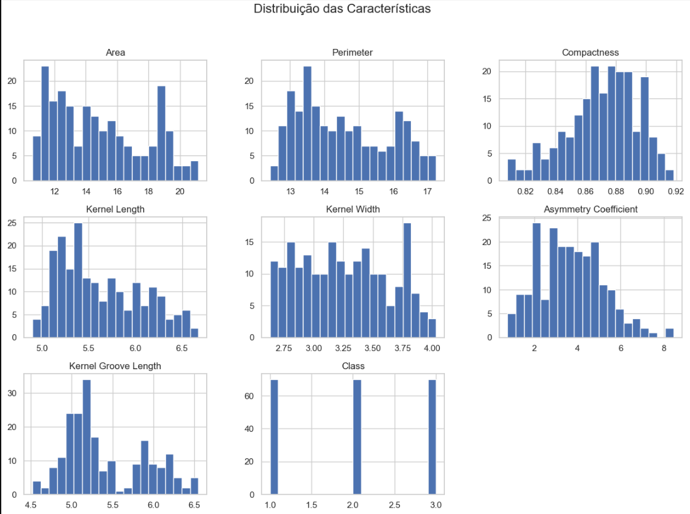
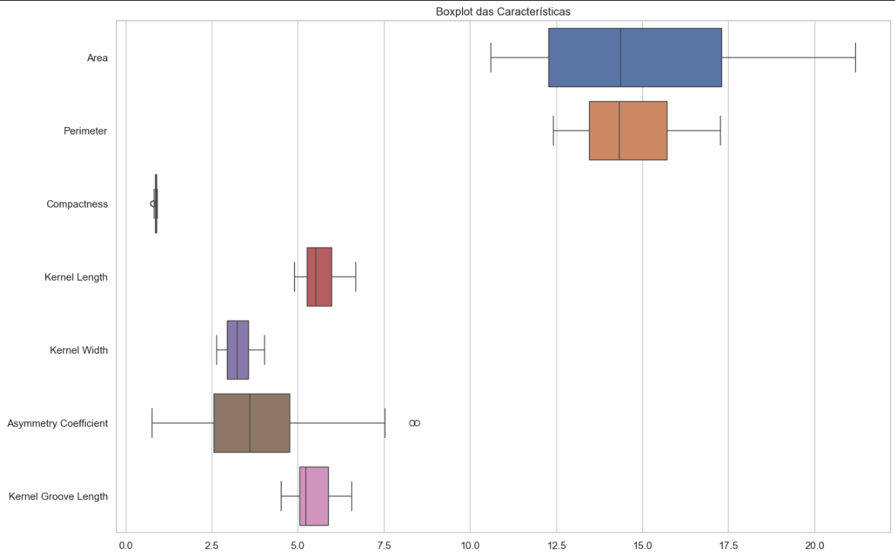
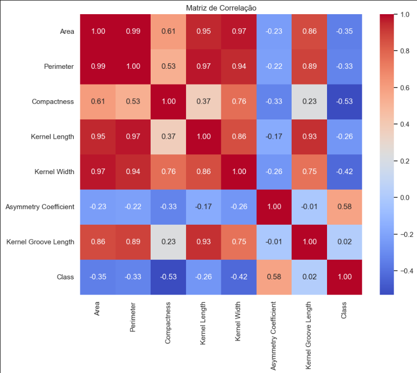
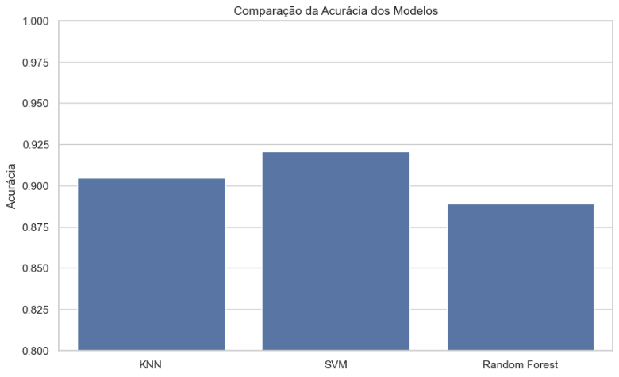
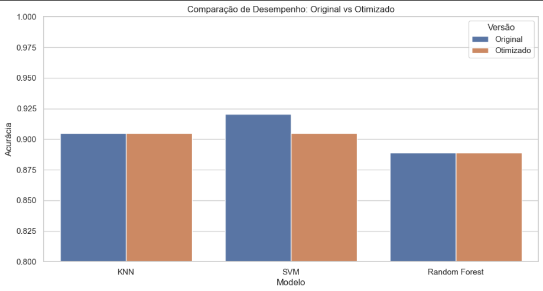

# FIAP - Faculdade de Informática e Administração Paulista

<p align="center">
<a href= "https://www.fiap.com.br/"></a>
</p>

<br>

# Classificação de Grãos com Machine Learning

## 👨‍🎓 Integrantes: 
- <a href="https://www.linkedin.com/in/gabriel-oliveira-b6353a16b/">Gabriel Oliveira dos Santos</a>
- <a href="https://www.linkedin.com/in/roberson-pedrosa-304ab523a/">Roberson Pedrosa de Oliveira Junior</a>
- <a href="https://www.linkedin.com/in/arthur-bruttel-7171b8381">Arthur Bruttel Nascimento</a> 
- <a href="https://www.linkedin.com/in/jonviotti/">Jonatan Viotti Rodrigues da Silva</a> 
- <a href="https://www.linkedin.com/in/eusamuelrocha/">Samuel Nicolas Oliveira Rocha</a>

## 👩‍🏫 Professores:
### Tutor(a) 
- <a href="https://www.linkedin.com/in/sabrina-otoni-22525519b/">Sabrina Otoni</a>
### Coordenador(a)
- <a href="https://www.linkedin.com/company/inova-fusca">André Godoi Chiovato</a>


## 📜 Descrição

Este projeto tem como objetivo automatizar o processo de classificação de grãos de trigo em cooperativas agrícolas de pequeno porte. Utilizando a metodologia **CRISP-DM** (Cross Industry Standard Process for Data Mining), desenvolvemos um modelo de aprendizado de máquina capaz de identificar três variedades de trigo: **Kama**, **Rosa** e **Canadian**, com base em suas características físicas (área, perímetro, compacidade, comprimento e largura do núcleo, coeficiente de assimetria e comprimento do sulco).

O projeto aborda desde a análise exploratória e pré-processamento dos dados até a implementação, comparação e otimização de algoritmos de classificação como **K-Nearest Neighbors (KNN)**, **Support Vector Machine (SVM)** e **Random Forest**.

### Resultados Preliminares
Os modelos apresentaram alta acurácia na classificação das variedades, demonstrando o potencial da solução para aumentar a eficiência e reduzir erros humanos no processo de triagem.

<br>
<p align="center">
  <strong>Historigrama da Distribuição das Características</strong>
  <br>
  
</p>
<br>

<br>
<p align="center">
  <strong>Boxplots das Características</strong>
  <br>
  
</p>
<br>

<br>
<p align="center">
  <strong>Matriz de Correlação</strong>
  <br>
  
</p>
<br>

<br>
<p align="center">
  <strong>Pairplot Relações entre Variáveis</strong>
  <br>
  
</p>
<br>

<br>
<p align="center">
  <strong>Comparação da Acurácia dos Modelos</strong>
  <br>
  
</p>
<br>

<br>
<p align="center">
  <strong>Comparação de Desempenho de Modelos: Original vs Otimizado</strong>
  <br>
  
</p>
<br>

## 📁 Estrutura de pastas

Dentre os arquivos e pastas presentes na raiz do projeto, definem-se:

- <b>assets</b>: Contém o dataset (`seeds_dataset.txt`), documentos de planejamento e imagens do projeto.

- <b>notebooks</b>: Contém o Jupyter Notebook (`grain_classification.ipynb`) com todo o código de análise, modelagem e otimização.

- <b>requirements.txt</b>: Lista de dependências do projeto.

- <b>README.md</b>: Guia e explicação geral sobre o projeto.

## 🔧 Como executar o código

### Pré-requisitos
- Python 3.8+
- Jupyter Lab ou Notebook
- Bibliotecas listadas em `requirements.txt`

### Instalação e Execução

1.  **Clone o repositório:**
    ```bash
    git clone https://github.com/fiap-1tiaos/fase4-cap3-ml-graos.git
    cd fase4-cap3-ml-graos
    ```

2.  **Crie e ative um ambiente virtual (opcional, mas recomendado):**
    ```bash
    python -m venv venv
    # Windows
    .\venv\Scripts\activate
    # Linux/Mac
    source venv/bin/activate
    ```

3.  **Instale as dependências:**
    ```bash
    pip install -r requirements.txt
    ```

4.  **Execute o Jupyter Lab:**
    ```bash
    jupyter lab
    ```

5.  **Abra o notebook:**
    Navegue até a pasta `notebooks` e abra o arquivo `grain_classification.ipynb`. Execute as células sequencialmente para reproduzir a análise e os modelos.

## 🗃 Histórico de lançamentos

* 0.1.0 - 27/11/2025
    * Análise exploratória de dados completa.
    * Implementação de modelos KNN, SVM e Random Forest.
    * Otimização de hiperparâmetros via Grid Search.
    * Documentação inicial.

## 📋 Licença

<p xmlns:cc="http://creativecommons.org/ns#" xmlns:dct="http://purl.org/dc/terms/"><a property="dct:title" rel="cc:attributionURL" href="https://github.com/agodoi/template">MODELO GIT FIAP</a> por <a rel="cc:attributionURL dct:creator" property="cc:attributionName" href="https://fiap.com.br">Fiap</a> está licenciado sobre <a href="http://creativecommons.org/licenses/by/4.0/?ref=chooser-v1" target="_blank" rel="license noopener noreferrer" style="display:inline-block;">Attribution 4.0 International</a>.</p>
